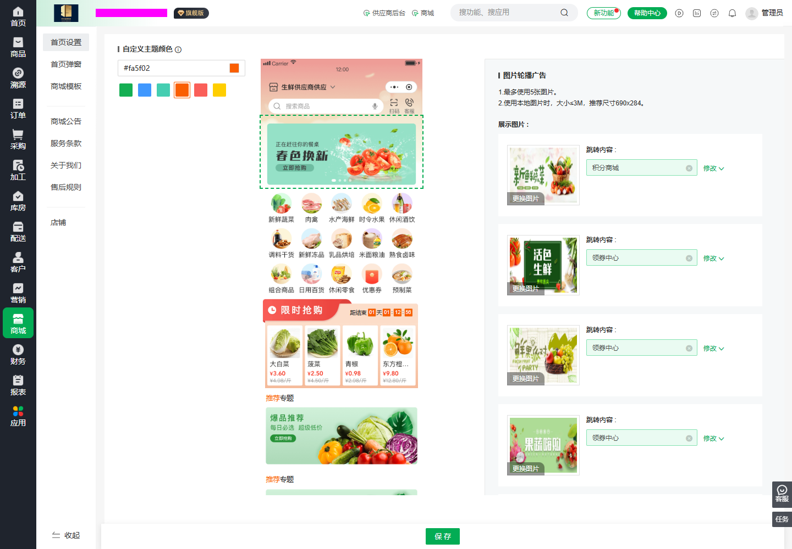

# 蔬东坡功能参考与借鉴记录

调查日期：2026-09-08
状态：第一轮只读调查；作为鲜蔬源智链设计参考，不是已批准的实现规格。

## 1. 调查范围与证据

已登录用户提供的后台账号，查看商品、订单、采购、库房分拣、客户、协议价、库存、入库、售后、配送、商城、营销、财务、报表、溯源和应用中心相关页面。另通过店铺页面提供的链接访问 H5 商城，查看游客首页、分类和快捷下单入口。

- [后台起始页：商品档案](https://scm.sdongpo.com/cc_wangyan/superAdmin/viewCenter/v1/goods/list)
- [H5 商城](https://scm.sdongpo.com/cc_wangyan/wap)
- [页面调查索引](./页面调查索引.md)：21 条后台观察记录，包含重复深入查看的首页配置，以及 3 个 H5 路由；并非 21 个独立业务模块。
- [管理后台仪表盘参考](./管理后台仪表盘参考.md)：首页完整截图、区块结构、指标口径及 `xsy-scm-web` 接入建议。
- [侧边栏功能与需求对照](./侧边栏功能与需求对照.md)：按原需求 13 个模块归类，并链接 149 个菜单入口的逐项映射。
- [前端与小程序编写规范借鉴](../smartadmin/前端与小程序编写规范借鉴.md)：参考 Web/App 的目录、页面、请求、状态、权限和测试写法，并对照当前 React 约束。
- [产品功能需求基线](../../requirements/产品功能需求基线.md)
- [商城与小程序统一规划](../../roadmap/商城与小程序规划.md)

本次未新增、保存、修改、删除业务数据，未执行刷价、分拣、收货、结算、导出、支付或发布。商品编辑页面仅打开查看字段和页签。未保存账号密码、Cookie、Token 或完整业务数据导出。

证据层级：

- **页面观察**：实际打开页面，看到字段、筛选、页签、入口或展示内容。
- **说明观察**：应用介绍或页面说明声称的能力，未实际执行验证。
- **待验证**：需要客户登录、付费开通、真实设备或业务写操作的流程。

部分页面出现网络较慢提示；加载中的“暂无数据”不作为真实业务数据为空的结论。页面结构中可存在隐藏弹窗，索引表头只用于后续定位参考，不代表每个字段均在当前视口展开。

## 2. 总体结论

参考站与需求清单匹配度较高，尤其是生鲜多单位、客户定价、订购与实际数量分离、采购执行、分拣打印、客户结算及订货商城。

最值得借鉴的是业务信息组织与操作效率：双层导航、业务状态页签、常用筛选与高级筛选、列表中的金额和进度、关联单据、手机端分类选品和快捷下单。我们仍沿用 Java 21 + React、模块化单体、现有 SPU/SKU 和已确认 Sprint 规则。

参考站的成熟范围明显大于当前项目阶段，不能把所有菜单直接转化为本期任务，也不能通过界面反推其数据库、事务、计价或权限实现。

## 3. 功能对照与具体借鉴点

| 我们的需求 | 页面观察 | 可借鉴设计 | 实施边界 |
| --- | --- | --- | --- |
| 商品档案、多规格、采购归属 | 商品信息含分类、名称、编码、别名、采购类型、默认供应商；单位表含起订量、增量订购、价格、售卖库存 | 基础信息与交易单位分区；按商品设置默认采购方式；展示规格起订要求 | 保留现有 SPU/SKU 模型，多单位换算另行设计 |
| 客户类型价、协议价、时价 | 商品页说明指定价、类型价、市场价优先次序；可见时价/部分时价/非时价选项 | 展示价格来源、生效期和适用对象；区分未定价与零价 | 当前协议价优先、市场价回退保持不变，新增类型价需独立规格 |
| 客户商品可见性 | 商品编辑含“指定客户售卖”，按单位页签查看客户；客户筛选含屏蔽/售卖商品 | 客户维度与商品维度都能查看授权关系 | 服务端统一执行同一策略，不能维护两套冲突规则 |
| 集团、账期、客户归属 | 客户列表有客户类型、集团、线路、业务员、账期、授信额度、状态；有子账号页签 | 联系、配送、结算、账号概念分区；增加组合筛选 | 集团结算不等于订单归属；先确认业务再扩模型 |
| 订单录入、实重、变更 | 订单状态页签；列表区分下单金额、发货金额、订单状态与付款状态；有实收变更和变更记录菜单 | 业务状态和支付状态分开；详情明确原始数量与实际数量 | 不照搬状态枚举；修改仍走本项目审计、版本和幂等机制 |
| 采购单、供应商、采购进度 | 采购页有按采购单/按商品视图，计划采购金额、已收货金额、实际金额、仓库和采购进度 | 单据视角与商品视角切换，计划与执行结果并列 | 不据此推断多次收货数据库模型；沿用当前收货确认批次设计 |
| 分拣、实重、打印 | 商品分拣和客户分拣入口；订购数量、实际数量、分拣单位、分拣员、分拣时间；缺货及阈值筛选 | 两种作业视角；差异、缺货与进度独立呈现 | 未连接秤或打印机，不能确认硬件行为 |
| 库存、预警、进销存 | 现有库存含在途库存、现有库存、库存均价、总金额、上下限、售卖库存下限 | 各库存口径命名明确；预警阈值与余额分离 | 库存均价字段不能证明加权平均算法，按本项目财务规则实现 |
| 配送路线和司机 | 线路页含线路订单/客户视图、司机、下单客户数、订单金额、分拣金额、配送进度 | 线路作业看板与订单/客户明细相互导航 | GPS、排线算法及轨迹未执行验证 |
| 应收应付与对账 | 客户结算列表区分应收、已收、实收、抹零、未收、对账状态、结算状态 | 结算详情解释金额组成与状态，关联来源业务单据 | 不直接采用对方公式、抹零规则或财务日期口径 |
| 经营与利润报表 | 营业数据展示订单笔数、客户数、下单金额、销售金额、退货金额、实际金额；菜单区分多类毛利 | 先定义指标口径，再提供维度切换和下钻 | 毛利、成本与业务日期规则未验证 |
| 溯源 | 检测报告列表及溯源查询、到期统计入口，筛选包括商品、供应商、采购单号和批次号 | 采购批次、检测资料与溯源查询关联 | 一物一码及设备采集仅有相关入口/说明，未核验实物链路 |

## 4. 商品与价格：优先参考的细节

来源：[商品档案](https://scm.sdongpo.com/cc_wangyan/superAdmin/viewCenter/v1/goods/list)，通过“编辑”只读打开表单；[协议价](https://scm.sdongpo.com/cc_wangyan/superAdmin/viewCenter/v1/agreementPrice/list)。

### 已看到

- 商品编辑分为商品信息、阶梯定价、附加信息、周转筐信息、指定客户售卖、商品条码等页签；本次深入查看商品信息和指定客户售卖，其余只确认入口。
- 采购类型区分供应商送货、市场自采、临时指定。
- 单位设置包含基础单位及辅助单位换算、起订量、增量订购、是否可售卖、市场价和客户类型价。
- 页面说明：产生采购单或订单后，基础单位及辅助单位转换系数不能修改。此为说明观察，未提交修改验证。
- 商品还区分标品/非标品、时价标志、常温/冷冻/冷藏、新品标记天数、采购预警天数。
- 支持主图、视频、图文详情上传入口。
- 协议价页面分协议单和协议商品视角，列表有客户、生效时间、终止时间、状态和商品种类数。

### 对我们的建议

1. 商品录入按“档案 → SKU/交易条件 → 采购默认值 → 商城展示”分区，避免一个页面平铺所有高级字段。
2. 起订量、订购步长、可售卖状态应落实到明确的交易单位，并在商城和服务端校验一致。
3. 价格优先级差异必须单独记录：参考页为指定价、类型价、市场价；当前 Sprint 2 为有效协议价优先、市场价回退。不能因参考站字段更多而覆盖当前锁价规则。
4. “时价”不是 0 元商品；是否允许未定价下单、何时确认价格，需要明确业务约束。
5. 多单位换算不等同于任意 SKU 库存转换。规格换算、基础库存单位和历史快照必须先设计。

## 5. 商城：可以直接转化为设计参考的内容

### 5.1 实际 H5 首页

来源：[H5 首页](https://scm.sdongpo.com/cc_wangyan/wap#/)；游客状态实际浏览。

观察到搜索栏、语音图标、客服入口、图片轮播、分类宫格、活动专题、商品分类快捷切换、商品列表、登录提示，以及底部五项导航：

```text
首页 | 分类 | 快捷下单 | 购物车 | 我的
```

商品展示包含名称、单位、价格或规格价格区间、销量、加购/选规格按钮；部分商品展示起购量，预售商品展示预计到货日期。游客页面提示登录后查看更多优惠价格，不能据此确认客户登录后的实际定价结果。


建议：面向高频企业采购，优先支持快速定位与重复采购。首页保留适量活动入口，首期不需要铺满节庆装饰或大量营销宫格。语音图标只证明入口存在，本次未录音或测试识别。

### 5.2 实际 H5 分类页

来源：[分类页](https://scm.sdongpo.com/cc_wangyan/wap#/pages/category/category)。

观察到：

- 顶部按商品名称或别名搜索。
- 上方一级分类横向入口，左侧二级分类，右侧商品列表。
- 默认排序与按销量排序入口。
- 商品展示图片、名称、价格/单位、销量、规格入口及收藏图标。
- 列表底部固定已选商品数与合计金额。
- 部分商品显示起购量或时价。


建议：以分类列表直接选品为主，详情页承载补充信息。选中商品的数量和金额反馈保持可见；提交前仍由服务端重新校验和计价。本次没有加购、收藏或提交订单，金额联动及持久化行为未验证。

### 5.3 快捷下单与客户登录边界

[快捷下单](https://scm.sdongpo.com/cc_wangyan/wap#/pages/quickorder/quickorder) 实际打开后要求客户登录。用户提供的是后台账号，本次未将其用于客户登录，也未注册客户。

因此：常购清单、再来一单、购物车结算、客户订单与支付、账单、售后申请的客户侧流程尚未验证。五项导航可以作为备选信息架构，但是否将快捷下单设为独立主导航，仍需结合我们的常购与历史订单设计评审。

### 5.4 后台首页装修

来源：[首页设置](https://scm.sdongpo.com/cc_wangyan/superAdmin/viewCenter/v1/shop/home-v3)。

页面采用“主题色设置 + 中间手机预览 + 右侧配置表单”的结构；当前轮播配置允许图片及跳转目标，目标包括推荐商品、分类、公告、领券中心、仅展示、自定义链接等。



截图已遮盖后台租户名称；截图为研究证据，不作为我们的产品素材。

页面对图片数量、大小及推荐尺寸有说明，但同页存在不同大小提示，不能直接当作我们上传校验规格。我们应统一限制、校验提示与服务端校验。

首期建议采用有限组件配置：轮播、分类导航、推荐商品、公告。跳转目标用类型化选择器维护，不允许后台任意拼接小程序路由。无需首期建设通用拖拽低代码装修器。

### 5.5 主题、弹窗和内容管理

- [商城模板](https://scm.sdongpo.com/cc_wangyan/superAdmin/viewCenter/v1/shop/home-v3/theme)：展示默认、开业、夏日、端午、618、中秋、春节等模板。当前账号显示未开通；页面说明描述应用模板、编辑、保存及发布流程，未实际验证发布。
- [首页弹窗](https://scm.sdongpo.com/cc_wangyan/superAdmin/viewCenter/v1/shop/home-v3/homeModal)：启用开关、每日首次/每次进入展示、生效时间、图片及跳转配置。未切换或保存。
- [售后规则](https://scm.sdongpo.com/cc_wangyan/superAdmin/viewCenter/v1/shop/afterSale)：可编辑说明内容。其具体退货时限与次数约定不作为我们项目规则，也未验证是否由系统强制执行。
- [店铺](https://scm.sdongpo.com/cc_wangyan/superAdmin/viewCenter/v1/shop/home-v3/base-info)：商城名称、二维码和商城链接入口。
- 菜单还包括商城公告、服务条款、关于我们；本次未逐一深入验证。

建议把主题外观与营销活动分开：切换皮肤不应自动创建促销价格。可考虑草稿、预览、发布版本的隔离，但这是我们提出的设计建议，不是已验证的参考站内部实现。

## 6. 订单、采购与分拣：值得保留的作业组织

### 订单

[订单列表](https://scm.sdongpo.com/cc_wangyan/superAdmin/viewCenter/v1/order/list) 采用状态页签、丰富筛选、列表及合计。筛选涉及发货日期、下单时间、客户、线路、司机、订单来源、打印与支付状态等。菜单将订单汇总、核价、售后、异常和变更记录分开。

建议默认仅展开常用筛选，其余放高级筛选，避免首屏过高。不同时间维度要明确标注，不能混用下单日期、发货日期和结算日期。列表中区分金额口径，详情解释差异。

### 采购与收货

[采购单](https://scm.sdongpo.com/cc_wangyan/superAdmin/viewCenter/v1/purchase/order-list) 支持按采购单/按商品查看；[入库管理](https://scm.sdongpo.com/cc_wangyan/superAdmin/viewCenter/v1/storeRoom/storageMGTList) 独立展示关联单号、仓库、类型、入库状态及业务发生日期。

建议复用当前采购与收货基础，增强计划量、已收量、剩余量及来源订单的可见性。参考站界面不能证明“一张采购单对应几张收货单”，不改变当前已确认的活动收货单和不可变确认批次规则。

### 分拣

[商品分拣](https://scm.sdongpo.com/cc_wangyan/superAdmin/viewCenter/v1/sorting/commodity) 有分拣打印、订单差异、商品/客户/分类进度、缺货商品等页签；筛选包含标品、分拣状态、供应商/采购员、分拣阈值、分拣员和线路。观察到一键分拣、打印、标记缺货等按钮，未执行。

建议将“待作业列表”“当前称重确认”“差异和异常”分区，批量操作展示作用范围并确认。继续采用 `xsy-device-agent` 标准重量事件；界面的实际数量必须来自确认后的业务记录，不能将实时跳动的秤值直接结算。

## 7. 财务、报表与应用边界

[客户结算](https://scm.sdongpo.com/cc_wangyan/superAdmin/viewCenter/v1/finance/user/audit-list) 将客户结算、对账、费用、结算单、账款、余额，与采购结算及支付/资金流水分开。我们可参考信息架构，但初期仍限定应收、收款、应付、付款和对账，不扩展完整总账。

[营业数据](https://scm.sdongpo.com/cc_wangyan/superAdmin/viewCenter/v1/reports/sales/trade) 及其导航区分销售、采购、毛利、进销存和损耗分析。建议每项指标提供口径说明，先确保与来源单据一致，再做可视化。

[应用中心](https://scm.sdongpo.com/cc_wangyan/superAdmin/viewCenter/v1/appCenter/list) 的介绍分别列出订单助手、采购助手、供应商端、配送助手、分拣软件和溯源小程序等。这里只确认介绍内容，未安装、开通或进入实际移动应用。

这支持我们将客户商城与员工操作端分开规划。应用介绍还出现 AI 录单、语音相关入口、外部平台对接等，不代表当前需求必须全部纳入。加工、周转筐、联营分账、税务和会计凭证等也不因参考站存在而加入当前 Sprint。

## 8. 建议候选清单

以下优先级为设计建议，不构成开发授权或排期承诺。

| 编号 | 候选改进 | 建议阶段 | 主要验收方向 |
| --- | --- | --- | --- |
| REF-01 | 商城分类直接选品、规格入口、固定数量/金额反馈 | 小程序 M1 | 分类切换、规格、数量反馈；客户价格由服务端决定 |
| REF-02 | 常购/快捷下单入口 | 小程序 M1 | 与历史订单、常购规则一致，重新验证可售卖和当前价 |
| REF-03 | 简单首页配置与手机预览 | 小程序 M1 | 配置与渲染一致、跳转目标有效、无未上线入口 |
| REF-04 | 客户价来源与有效期展示 | 客户定价专项 | 列表、详情、结算价格一致；现有优先级不变 |
| REF-05 | SKU 起订量与订购步长 | 商品/商城专项 | 小数精度与单位明确，前后端一致校验 |
| REF-06 | 订单/采购常用筛选与执行进度 | 对应业务页面迭代 | 已有接口兼容、分页、金额与数量口径准确 |
| REF-07 | 商品/客户双视角分拣与异常提示 | 分拣阶段 | 实重确认、缺货、重复提交、打印及硬件异常 |
| REF-08 | 客户结算金额组成与关联单据 | 财务阶段 | 应收、收款、退款、抹零与对账有明确规则 |
| REF-09 | 主题模板、弹窗频率及有效期 | 小程序 M3 | 外观与促销分离，配置有效期与发布行为明确 |
| REF-10 | 检测资料有效期与批次溯源 | 溯源阶段 | 采购批次到检测资料可追踪，客户展示范围正确 |

## 9. 后续需要补充的证据

1. 客户账号下的快捷下单、再来一单、购物车、结算、订单和售后完整流程。
2. 微信小程序真实界面与当前 H5 的差异；本次 H5 观察不能替代小程序真机证据。
3. 付费模板发布效果、配置版本行为；目前仅有页面说明。
4. 支付回调、退款、客户价格重算、库存并发、订单审核与多次收货的真实行为。
5. 电子秤稳定判定、断连处理、实重写回和打印恢复流程。
6. 角色权限配置与客户数据隔离的运行时验证。

实现时借鉴布局、字段组织和流程思想，使用鲜蔬源自己的品牌、主题和素材。参考站规则与当前规格冲突时，记录差异并单独评审，不直接覆盖已有实现。
