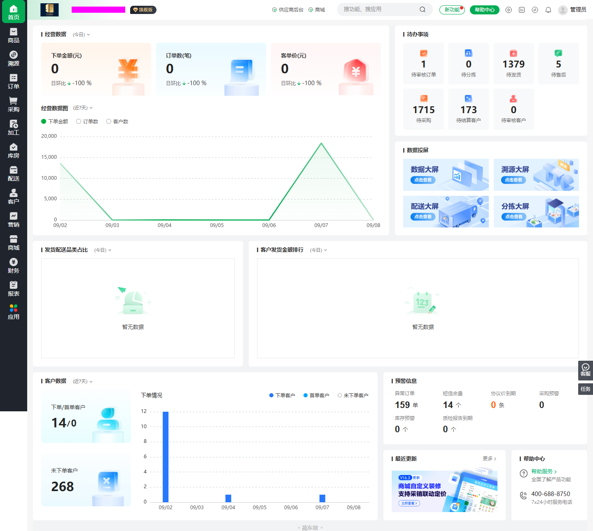

# 管理后台仪表盘参考：供 xsy-scm-web 使用

调查日期：2026-09-08
状态：页面参考与接入建议，未实施；指标口径与开发范围待确认。

## 1. 来源与使用方式

参考页面：[蔬东坡管理后台首页](https://scm.sdongpo.com/cc_wangyan/superAdmin/viewCenter/v1/index)。本次实际登录查看了完整页面、经营指标时间选项，并点击“待审核订单”验证导航。没有执行业务写操作。

本文把**参考站实际观察**与**鲜蔬源实现建议**分开。截图中的数量仅为调查时点的数据，不作为测试基准、演示数据或业务口径依据。租户名称已遮盖，未保存登录凭证。

关联资料：

- [整体功能参考与借鉴记录](./功能参考与借鉴记录.md)
- [项目 UIUX 指导](../../design/xsy-scm-UIUX设计与前端开发指导-v1.1.md)
- [项目设计草案](../../architecture/xsy-scm-项目设计草案-v0.2.md)



## 2. 实际页面结构

参考页面是浅色管理端经营首页，采用深色一级导航、顶部工具栏、浅灰背景和白色内容卡片。该首页没有显示业务二级菜单，内容区比较宽；这不意味着我们需要取消现有双侧栏架构。

在本次 1440 × 1000 浏览器视口下，观察到如下布局，完整页面需纵向滚动：

```text
一级导航 │ 顶部品牌、搜索、帮助、用户入口
         ├─────────────────────────┬─────────────────┐
         │ 经营指标：金额/订单/客单价 │ 待办事项         │
         │                         ├─────────────────┤
         │ 经营趋势图               │ 数据投屏入口      │
         ├────────────────┬────────┴─────────────────┤
         │ 发货配送品类占比 │ 客户发货金额排行          │
         ├────────────────┴────────┬─────────────────┤
         │ 客户数据与下单情况       │ 预警信息          │
         │                         ├─────────┬───────┤
         │                         │ 最近更新 │ 帮助  │
         └─────────────────────────┴─────────┴───────┘
```

页面的阅读顺序是“经营表现 → 当前待办 → 业务结构 → 客户活跃 → 异常提醒”。待办保持在首屏右侧，经营图不挤占全部操作入口。

## 3. 观察到的模块与交互

| 模块 | 实际内容 | 已确认的交互或限制 |
| --- | --- | --- |
| 经营数据 | 下单金额、订单数、客单价；每项显示日环比 | 时间菜单可见今日、近 7 天、近 30 天；未逐项验证计算结果 |
| 经营数据图 | 默认近 7 天；下单金额、订单数、客户数切换入口；折线及浅色面积 | 看到了金额趋势；其他指标切换后的数值一致性未验证 |
| 待办事项 | 待审核订单、待分拣、待发货、待售后、待采购、待结算客户、待审核客户 | 点击待审核订单进入订单列表并携带 `navActive=100`；未验证所有入口 |
| 数据投屏 | 数据大屏、溯源大屏、配送大屏、分拣大屏 | 仅确认入口，未进入或验证大屏 |
| 发货配送品类占比 | 标题和独立时间入口 | 本次今日数据为空，仅观察到空状态，不能确认有数据时的图形类型 |
| 客户发货金额排行 | 标题和独立时间入口 | 本次为空，排序规则、Top N 和有数据布局未验证 |
| 客户数据 | 下单/首单客户、未下单客户，下单情况柱状图及三类图例 | 默认近 7 天；去重范围和首单定义未验证 |
| 预警信息 | 异常订单、短信余量、协议价到期、采购预警、库存预警、质检报告到期 | 展示数值和单位；触发规则与跳转未验证 |
| 最近更新、帮助中心 | 更新宣传、更多、帮助入口和服务信息 | 属于辅助信息，不是经营核心 |

参考站各区块分别带时间范围，不能假设修改上方时间会联动所有模块。“待结算客户”以客户计数，与待结算单据数也不是同一指标。

## 4. 面向鲜蔬源的布局建议

### 4.1 页面定位

首页用于帮助运营人员发现问题并进入业务页面，采用 **Admin Theme**，不是 Screen Theme 大屏。保留正常文档滚动，不使用 1920 × 1080 整体缩放。

建议第一版保留：

1. 三项经营摘要：订单金额、有效订单数、客单价。
2. 一张经营趋势图，按金额/订单数/客户数切换。
3. 与已有业务能力对应的待办入口。
4. 有明确规则和权限支持的预警。

客户排行、品类占比、客户活跃度和大屏入口在对应业务及聚合接口具备后再增加。帮助信息可作为底部轻量链接，不需要占用大面积宣传卡片。

### 4.2 栅格与视觉

- 宽屏采用约 16:8 的经营区/待办区比例；卡片间距建议 16px，使用统一栅格控制对齐。
- 经营摘要三项等宽；待办建议每行 3—4 项，显示名称、数量及单位。
- 页面标题、卡片标题和指标值保持明确层级；建议卡片标题 14—16px，指标值 28—32px，说明 12—14px。具体样式以项目 token 和 UI 规范为准。
- 使用现有绿色主色、浅灰背景、白色容器、细边框。指标数字使用等宽数字排版。
- 不照搬参考站立体装饰图、大面积渐变、大屏宣传图片和品牌素材。用现有图标及轻量状态色表达业务。
- 趋势变化应同时显示文字和符号，不能仅靠红绿颜色。金额上涨不自动等同于经营改善，预警上升也不应使用同样的成功语义。
- 正常空状态保持紧凑，不为无数据图表留下过大空白。

### 4.3 响应式

- 1920、1440 宽度优先双列；在 1280/1366 宽度结合实际侧栏后的可用空间验证，不机械按浏览器宽度决定列数。
- 内容区较窄时，待办下移、摘要自动换行，保证文字和数字完整；不缩小整个页面。
- 图表随容器变化重算尺寸，避免二级侧栏或窗口变化后画布裁切。
- 主内容不应产生整页横向滚动。排行榜名称允许截断并提供完整名称提示。

以上为鲜蔬源设计建议，并非参考站响应式行为的测试结论。

## 5. 当前 web 工程接入点

以下为 2026-09-08 本地代码检查结果：

| 位置 | 当前状态 | 将来接入建议 |
| --- | --- | --- |
| `xsy-scm-web/src/router/index.tsx` | 根路由重定向到 `/products`，尚无独立首页 | 经批准后将 index 路由改为懒加载仪表盘，保留商品路径 |
| `xsy-scm-web/src/layouts/AdminLayout/navigation.tsx` | 已有首页 `/` 入口 | 复用现有导航项，不再增加一个重复首页 |
| `xsy-scm-web/src/layouts/AdminLayout/index.tsx` | 主导航匹配排除 `/`，未匹配时回退到商品 | 首页接入时必须同步修正 `/` 的选中逻辑，防止首页仍高亮商品 |
| `xsy-scm-web/src/components/common/PageContainer.tsx` | 已有通用页面容器 | 复用容器；必要布局调整限制在首页及明确受影响的壳逻辑 |
| `xsy-scm-web/src/styles/tokens.ts` | 已有 Admin 颜色及布局值 | 复用 token，不在首页散布独立色值 |
| `xsy-scm-web/package.json` | 已有 Ant Design、ProComponents、TanStack Query；当前未列出 ECharts | 摘要和布局复用现有组件；图表依赖实施时按需评估，不能假定已安装 |

另一个需要注意的现状：当前布局 token/样式使用顶部 48px、一级侧栏 66px、二级侧栏 110px；项目指导的推荐尺寸为 56px、80px、约 140px。此次记录不调整这些尺寸。首页迭代不应顺带重构全站壳；如需统一，单独确定变更范围。

参考站首页隐藏二级菜单；我们的当前壳始终渲染二级侧栏。建议明确首页的二级导航策略：复用现有双层壳并提供有实际作用的“工作台”入口，或独立评审仅首页收起空二级栏。不要在页面内强行覆盖全局 CSS 达成效果。

建议的新增文件边界（尚未创建）：

```text
xsy-scm-web/src/
├─ pages/dashboard/
│  ├─ DashboardPage.tsx
│  ├─ DashboardPage.module.css
│  └─ components/
│     ├─ BusinessOverview.tsx
│     ├─ BusinessTrend.tsx
│     ├─ TodoPanel.tsx
│     └─ AlertPanel.tsx
├─ api/dashboard.ts
└─ types/dashboard.ts
```

先使用页内组件，等其他页面确实需要再提取共享组件，不为四张卡片建立复杂可配置仪表盘框架。

## 6. 指标口径：必须先确定再展示

下面列出需要明确的计算语义，而不是声称已掌握参考站公式。

| 指标 | 实施前必须明确 |
| --- | --- |
| 订单金额 | 按创建还是提交时间；包含哪些状态；使用下单锁价金额还是实重结算金额；是否含运费、取消和退货 |
| 有效订单数 | 有效状态集合、时间范围、补单是否独立计数；必须与金额口径匹配 |
| 客单价 | 同范围金额除以订单数还是客户数；建议如按订单数计算明确写“平均每单金额”，订单数为 0 时显示 `—` |
| 环比 | 今日截至当前时刻与昨日同时刻比较，还是完整自然日；近 7/30 天与哪个等长区间比较 |
| 下单客户数 | 按客户 ID 去重；集团/子单位是否独立；各日去重客户数不能直接相加作为期间总客户数 |
| 首单客户数 | 首笔有效订单发生于本期间；需明确历史范围和取消订单影响 |
| 未下单客户数 | 从哪些启用、可见客户中扣除本期下单客户；停用客户和权限外客户不应默认计入 |
| 待审核订单 | 映射当前订单状态和用户可操作范围，不直接使用参考站 `navActive=100` 编码 |
| 待采购/待收货 | 计量对象是需求条目、采购单还是 SKU；数量标签与跳转列表保持一致 |
| 协议价到期 | 已过期还是未来 N 天将到期；按协议单或价格记录计数；不能只写模糊的“到期” |
| 库存预警 | 阈值配置是否存在；按仓库+SKU 还是商品汇总；库存与售卖库存口径不可混用 |
| 品类占比和客户排行 | 依据发货、签收或结算金额；分类层级、退款扣减、Top N 和“其他”的规则 |

共同比例规则：对比基数为 0 时，不显示无穷大或伪造百分比，可显示“无可比基数”；缺失数据与真实 0 明确区分。金额以服务端十进制结果为准，前端只格式化，不进行权威财务计算。

日期统一使用明确业务时区及边界，建议接口返回实际查询区间与更新时间。图表补零只用于服务端确认无业务发生的日期，接口失败不得补零掩盖。

## 7. 数据接口、状态与权限建议

- 仪表盘使用服务端聚合接口，不在浏览器拉取所有订单、客户或库存记录后计算。当前未发现 `report`、`screen` 目录，不能将这些聚合接口视为现成能力。
- 可以按摘要、趋势、待办、预警拆查询，允许局部失败与局部重试；具体 API 合同在实现规格中设计，不在本文预设已存在接口。
- TanStack Query 管理服务端数据，筛选和时间区间进入查询键；切换筛选后旧响应不能覆盖新结果。
- 默认采用适度缓存、手动刷新或重新聚焦刷新。自动轮询间隔需结合业务时效和后端成本确认，不做高频全页刷新。
- 所有聚合必须在服务端执行角色及数据范围过滤。前端隐藏卡片不能替代授权；无权限用隐藏或明确受限状态，不能显示为 0。
- 每个区块考虑 loading、empty、error、success、retry；首次加载用骨架，失败在卡片内说明，不弹出整页 Toast 风暴。
- 刷新中可保留上次成功数据并标明更新时间；不可把缓存值伪装成实时值。
- 待办点击应进入带对应筛选的业务列表，返回时保留首页时间条件。不要引用参考站内部筛选编码。
- 尚未建设的分拣、配送、客户审核、质检和真实结算等能力，按实际建设状态决定隐藏或延后。不能用虚构的 0 或可点击空入口填满布局。

## 8. 推荐交付顺序

### 第一阶段：可用工作台

- 独立首页路由、正确导航高亮和布局。
- 已有订单/采购/收货/售后业务范围内的真实待办，先确认对应状态及列表筛选能力。
- 口径已确认的经营摘要与趋势。
- 时间范围、更新时间、加载失败和权限处理。

### 第二阶段：运营分析

- 客户活跃分析、品类结构、客户排行。
- 有明确规则的协议价到期和库存预警。
- 指标下钻，与报表及业务列表对账。

### 第三阶段：扩展入口

- 分拣、配送、质检、财务相关待办与预警。
- 已建设完成并有权限控制的数据大屏入口。
- 必要的帮助与更新信息。

这些阶段是候选拆分，不变更现有 Sprint 或自动授权实施。

## 9. 验收清单

- `/` 展示仪表盘，首页正确高亮，商品及其他业务导航保持可用。
- 摘要、趋势、列表下钻采用一致时间/权限/状态口径。
- 核查真实数据、真实 0、接口失败、无权限、无可比基数等不同状态。
- 验证今日、跨日、近 7 天、近 30 天边界，以及环比基数为 0 的情况。
- 待办数量对应的计量对象与目标列表一致，不能只验证页面跳转成功。
- 在 1366×768、1440×900、1920×1080 等常用桌面尺寸检查滚动、数字完整性和图表尺寸。
- 用键盘可操作时间切换、刷新及待办入口；图表提供文本摘要或可访问说明。
- 实现时执行 web 的 lint、typecheck、test、build；浏览器检查 Console、Network 和主路径。后端聚合需验证业务口径、权限及数据库查询成本。

本次仅创建参考文档和截图，没有实现 web 仪表盘，也没有运行前后端构建测试。参考站仅验证了首页展示及一项待办导航，不代表其指标计算或权限已通过审计。
