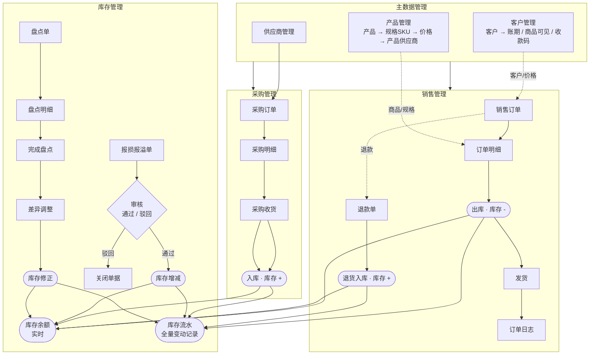

# XSY-SCM 生鲜供应链管理系统 · 业务流程总览

## 端到端流程说明

1. **主数据**：先维护「产品 + 规格(SKU) + 价格 + 产品供应商」，以及「客户 + 账期 + 商品可见 + 收款码」和「采购供应商」。这是后续业务的基础。
2. **采购链路**：供应商 → 采购订单 → 采购明细 → **采购收货** → 入库（库存 +），每一笔变动写入库存流水。
3. **销售链路**：客户 → 销售订单 → 订单明细（扣减对应商品/规格）→ **出库（库存 -）** → 发货 → 生成订单日志；发生退货时走退款单 → 退货入库（库存 +）。
4. **库存操作**：
   - **报损报溢**：生成调整单 → 需**审核**（通过才真正增减库存，驳回则关闭单据）。
   - **盘点**：生成盘点单 → 录入盘点明细 → **完成盘点** → 差异调整修正库存。
   - 所有增减最终都落到「库存余额」并留痕于「库存流水」。
